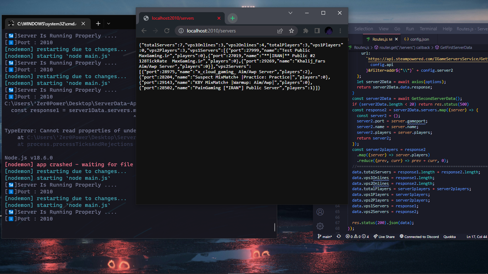

<!-- PROJECT LOGO -->
<br />
<div align="center">
  <a href="https://github.com/Zer0Power/ServerData-Api">
    
  </a>

  <h3 align="center">ServerData Api</h3>

  <p align="center">
    Get CS:GO ServersList Running On VPS
    <br/>
    <a href="https://github.com/Zer0Power/ServerData-Api"><strong>Explore the docs »</strong></a>
    <br/>
    <br/>
    <a href="https://github.com/Zer0Power/ServerData-Api">View Demo</a>
    ·
    <a href="https://github.com/Zer0Power/ServerData-Api/issues">Report Bug</a>
    ·
    <a href="https://github.com/Zer0Power/ServerData-Api/issues">Request Feature</a>
  </p>
</div>


<!-- TABLE OF CONTENTS -->
<details>
  <summary>Table of Contents</summary>
  <ol>
    <li>
      <a href="#about-the-project">About The Project</a>
    </li>
    <li>
      <a href="#getting-started">Getting Started</a>
      <ul>
        <li><a href="#prerequisites">Prerequisites</a></li>
        <li><a href="#installation">Installation</a></li>
      </ul>
    </li>
    <li><a href="#roadmap">Roadmap</a></li>
    <li><a href="#contributing">Contributing</a></li>
    <li><a href="#license">License</a></li>
    <li><a href="#contact">Contact</a></li>
  </ol>
</details>

<!-- ABOUT THE PROJECT -->
## About The Project



<p align="right">(<a href="#top">back to top</a>)</p>

<!-- GETTING STARTED -->
## Getting Started

This is an example of how you may give instructions on setting up your project locally.
To get a local copy up and running follow these simple example steps.


### Installation
1. Get Api_Key From Steam

[Steam Apis](https://steamcommunity.com/dev)

2. Clone the repo.
   ```sh
   git clone https://github.com/Zer0Power/ServerData-Api.git
   ```
3. Install NPM packages
   ```sh
   npm install
   ```
4. Enter your API_KEY & servers in `src/config.json`
   ```json
   {
    "api":"API_KEY",
    "server1":"185.141.104.39",//Your ServerIP
    "server2":"185.141.133.16"//Your ServerIP
    }
   ```

<p align="right">(<a href="#top">back to top</a>)</p>

<!-- ROADMAP -->
## Roadmap

See the [open issues](https://github.com/Zer0Power/ServerData-Api/issues) for a full list of proposed features (and known issues).

<p align="right">(<a href="#top">back to top</a>)</p>

<!-- CONTRIBUTING -->
## Contributing

Contributions are what make the open source community such an amazing place to learn, inspire, and create. Any contributions you make are **greatly appreciated**.

If you have a suggestion that would make this better, please fork the repo and create a pull request. You can also simply open an issue with the tag "enhancement".
Don't forget to give the project a star! Thanks again!

1. Fork the Project
2. Create your Feature Branch (`git checkout -b feature/AmazingFeature`)
3. Commit your Changes (`git commit -m 'Add some AmazingFeature'`)
4. Push to the Branch (`git push origin feature/AmazingFeature`)
5. Open a Pull Request

<p align="right">(<a href="#top">back to top</a>)</p>

<!-- LICENSE -->
## License

Distributed under the MIT License. See `LICENSE.txt` for more information.

<p align="right">(<a href="#top">back to top</a>)</p>

<!-- CONTACT -->
## Contact


Project Link: [https://github.com/Zer0Power/ServerData-Api](https://github.com/Zer0Power/ServerData-Api)

<p align="right">(<a href="#top">back to top</a>)</p>
